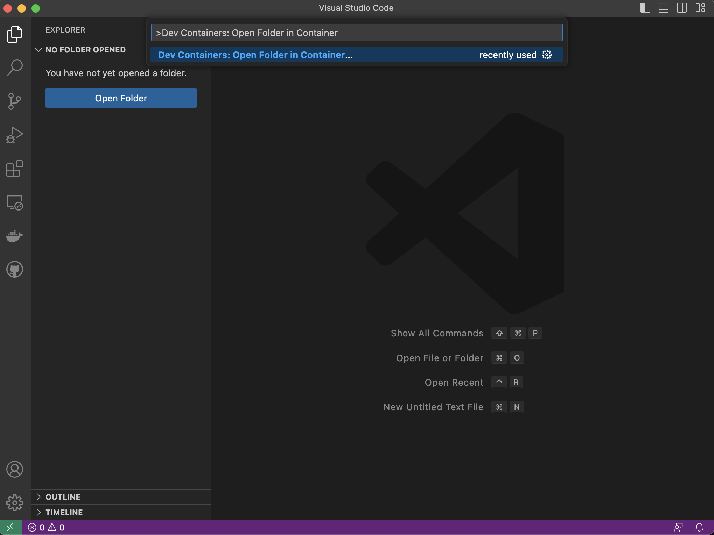
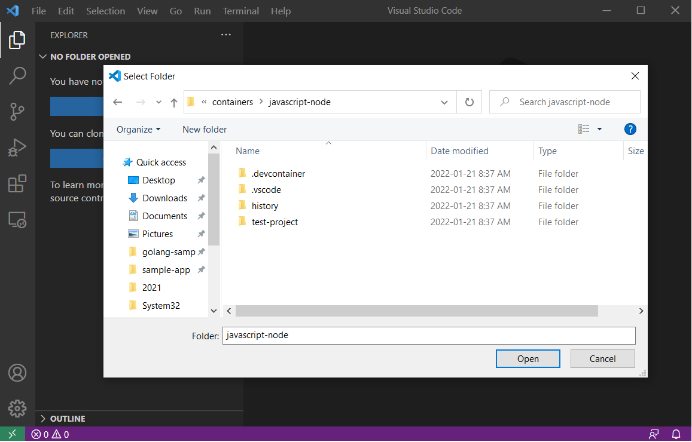

<head>
  <link rel="canonical" href="https://docs.rancherdesktop.io/how-to-guides/vs-code-remote-containers"/>
</head>

The [Visual Studio Code Remote - Containers] extension lets you use a Docker container as a full-featured development environment, which helps ensure a consistent environment across developer machines and makes it easy for new team members and contributors to get up and running. Since Rancher Desktop supports Docker CLI via [Moby], you can use the Visual Studio Code Remote - Containers extension out-of-the-box.

### Steps to try a sample dev container

1. Install and launch Rancher Desktop. Select `dockerd (moby)` as the Container Runtime from the `Kubernetes Settings` menu.


2. Install and launch Visual Studio Code or Visual Studio Code Insiders. This tutorial uses Visual Studio Code.


3. Install the Remote Development extension pack. 


4. After the extension is installed, you will see the extension item in the side bar, and a green button at the lower left corner to show the command palette with various options/commands related to `Remote Development`.


5. Microsoft provides a number of sample dev containers at this GitHub repository: https://github.com/microsoft/vscode-dev-containers.git. Clone this repository to your local machine.

```
git clone https://github.com/microsoft/vscode-dev-containers.git
```

6. Press `F1` to bring up a search bar on the command pallette to query for available commands. Begin to type in "Dev Containers: Open Folder in Container..." and click on the command `Dev Containers: Open Folder in Container...`. Browse to one of the samples in the cloned respository, e.g., `javascript-node`.






7. On selecting a sample, you will see the progress notification   while the container is being loaded, and once the container is successfully started, the bottom left corner shows the container name. 

8. Once the container is started, Press `F5` in the VS Code IDE to start the sample application. You will see that the application is started and served on `localhost:3000`.


Congratulations! You have successfully loaded and run a sample dev container using Rancher Desktop and VS Code.


### Next steps

Microsoft has provided extensive documentation about using dev containers in various scenarios [here]. Please refer to the following tutorials to try a use case that's relevant to your needs.

[Visual Studio Code Remote - Containers]: https://marketplace.visualstudio.com/items?itemName=ms-vscode-remote.remote-containers
[Moby]: https://mobyproject.org/
[here]: https://code.visualstudio.com/docs/remote/remote-overview

Happy Containerizing with Rancher Desktop!
